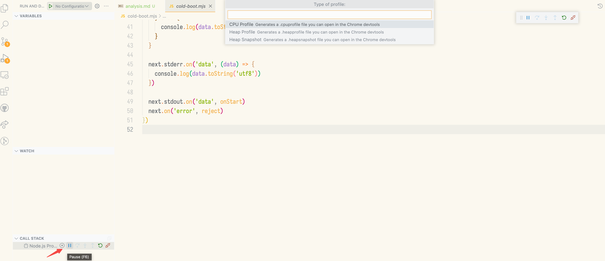
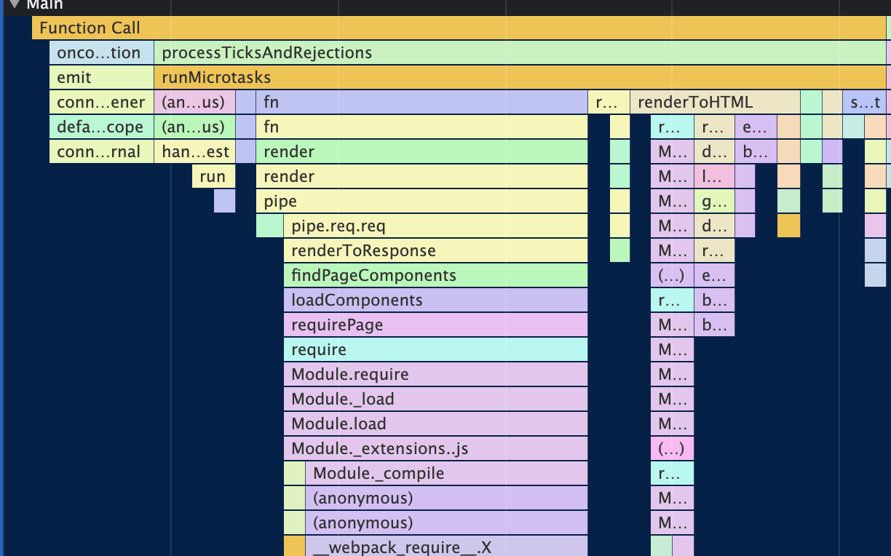
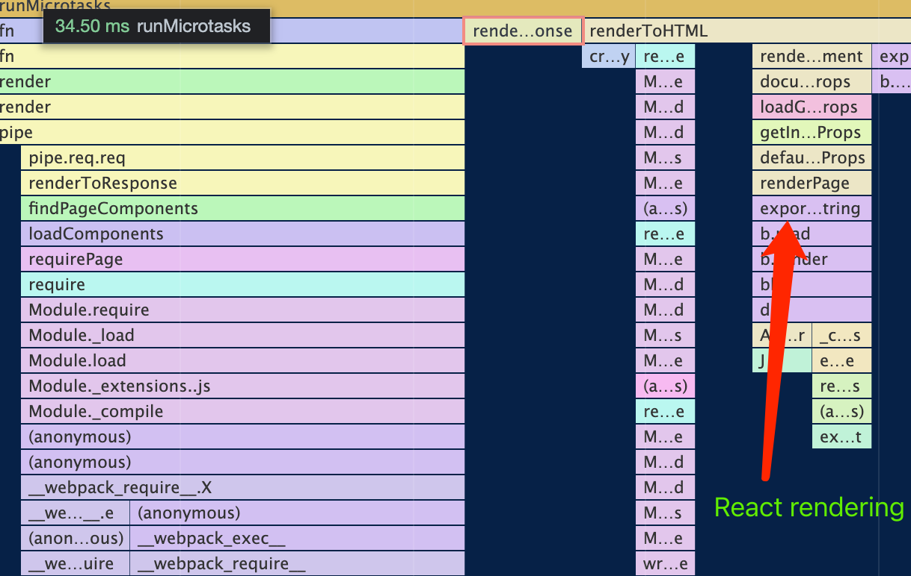
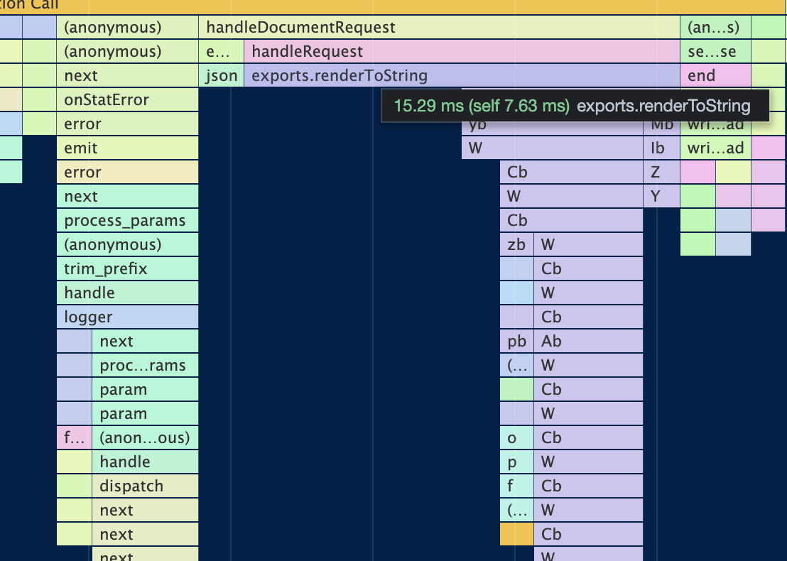
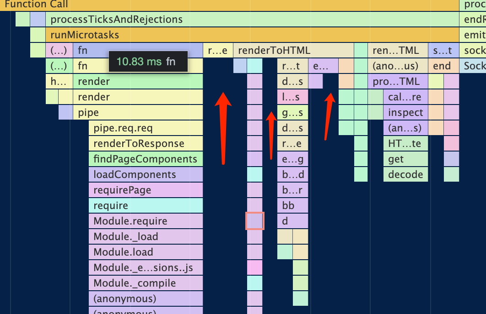

# Cold boot performance analysis

The codes live on [./cold-boot.mjs](./cold-boot.mjs)

The sample applications in this repo for next.js and remix are not the same, but it doesn't matter because the next.js app is more straightforward and should be faster. One of the goals of this repo is to find the performance bottleneck while cold booting the next.js Application.

## Analysis script

```javascript
console.time('next')
console.time('next-start')
const next = spawn(`node`, ['node_modules/.bin/next', 'start'])
const onStart = async (data) => {
  if (data.toString('utf8').startsWith('ready')) {
    console.timeEnd('next-start')
    await fetch(`http://localhost:3000`).then((res) => res.arrayBuffer())
    console.timeEnd('next')
    next.stdout.off('data', onStart)
    next.kill('SIGABRT')
    resolve()
  } else {
    console.log(data.toString('utf8'))
  }
}

next.stderr.on('data', (data) => {
  console.log(data.toString('utf8'))
})

next.stdout.on('data', onStart)
next.on('error', reject)

```

We are booting two independent servers, one is remix, and the other is next.js. Measuring the time cost between the `run server command` and the first request responded.

In the latest GitHub Actions CI, the benchmark result was:

```
Run node --expose-gc --experimental-fetch cold-boot.mjs
remix-start: 216.355ms
remix: 297.776ms
next-start: 104.3ms
next: 460.611ms
```

## CPU Profile

In VSCode JavaScript Debug Terminal, type the `node node_modules/.bin/next start` and run. Find the next.js server process, and click the profile button:



And then go to browser, visit the `localhost:3000`. After the page was ready, go back to VSCode, and stop the profile.

Here is a sample [`next-sample.cpuprofile`](./next-sample.cpuprofile) file generated by the steps below. We can open the Chrome Devtool and load the file:



We can generate [remix app CPU profile](./remix-sample.cpuprofile) with the same steps.

## Analysis of the CPU Profile

Here are problems that could be found in the CPU Profile:

### Too many dynamic load logics



Before React starts rendering the page, there are many dynamic `require` logic, and this logic mostly comes from [packages/next/server/load-components.ts#L105-L119](https://github.com/vercel/next.js/blob/v12.1.5/packages/next/server/load-components.ts#L105-L119).

As we can see, before the `react-dom/server` started rendering the contents, the whole application was stuck by the `loadComponents` logic.

Compared with the `remix` profile:



The `renderToString` takes up most of the execution time, which means less overhead in the framework.

### Wasting time on I/O



As you can see from the flame diagram below, the execution time of the whole program is not compact. The entire execution logic is roughly the following workflow:

- Find page components and manifest from the request.
- dynamic require `_app` `_document` `[pathname].js` , `_app.server` and execute them. This step is very slow, and all the code that is dynamically required at this step is executed before the engine can optimize it
- Very complex logic https://github.com/vercel/next.js/blob/v12.1.5/packages/next/server/base-server.ts#L1116-L1636 which **involved many small async codes**, which resulted in the CPU not being fully utilized in the process.
- Post render step. In this step, some next.js features not used in this project also lead to overheads, like font optimizer https://github.com/vercel/next.js/blob/v12.1.5/packages/next/shared/lib/post-process.ts#L70.

## Conclusion

The advantage of Remix is that all its logic is in a single bundle, it almost contains no dynamic require logic, and the bundle can also take advantage of the bundle toolchain, like dead code elimination and module concatenation. 

In short term, we can do some optimization while bunding the server output, like:

- Inline MANIFEST files
- Replace the value of `next.config.js` with const values during the build
- Refactor the render pipeline to avoid serialization await logic.

In the long term, I think ideally the non-browser target outputs of next.js should also be one or a few js files and contain as little dynamic logic as possible.

